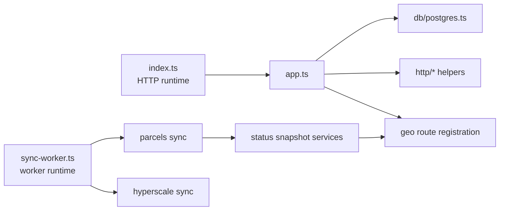

`apps/api` is a Bun + Hono service with two separate runtime entrypoints. The HTTP server handles request and response work. A second process runs long-lived sync loops. That split is the main foundation boundary to understand before looking at slice-specific route code.

## Entrypoints and process model

### HTTP server entrypoint

`apps/api/src/index.ts` is the production HTTP boot file:

- creates the Hono app through `createApiApp()`
- reads `PORT`, defaulting to `3001`
- starts `@hono/node-server`
- traps `SIGINT` and `SIGTERM`
- closes the shared Bun SQL pool during shutdown

The matching package script is `apps/api/package.json#scripts.dev`, which runs `bun --env-file .env --watch src/index.ts`.

### Background worker entrypoint

`apps/api/src/sync-worker.ts` is a separate long-running worker process:

- starts the hyperscale sync loop and parcels sync loop in parallel
- keeps controller handles so each loop can stop cleanly
- shuts down both controllers and the shared Bun SQL pool on `SIGINT` and `SIGTERM`
- fails fast if neither loop starts successfully

The matching package script is `apps/api/package.json#scripts.dev:sync-worker`, which runs `bun --env-file .env --watch src/sync-worker.ts`.

:::note Runtime Split
The HTTP server and sync worker share infrastructure such as contracts, ops helpers, and the Bun SQL client, but they are intentionally separate processes. Request handling should not own long-running sync lifecycle management.
:::

## HTTP runtime composition

### App construction

`apps/api/src/app.ts` is the authoritative composition root for the public HTTP surface. It builds the Hono app and owns the middleware stack that every route group inherits.

### Shared middleware and hardening

The middleware in `apps/api/src/app.ts` sets the baseline transport behavior:

- request ID propagation with `hono/request-id`
- request body limits for `/api/*`
- request timeout handling for `/api/*`
- shared JSON error handling through `app.onError`
- shared `404` handling through `app.notFound`
- health endpoints at `/health` and `ApiRoutes.health`

`apps/api/test/http/app-hardening.test.ts` is the best quick check for these guarantees. It verifies request ID propagation, body-limit failures, timeout behavior, and JSON content-type enforcement.

### Route registration boundary

The bottom of `apps/api/src/app.ts` is the authoritative registration point for the current geo-serving surface:

- boundaries
- facilities
- fiber locator
- parcels
- markets
- providers

This page stops at registration and shared runtime concerns. Use [API Geo Slices](/docs/applications/api-geo-slices) for route-by-route slice structure.

## Shared HTTP helpers

The `apps/api/src/http` folder is the transport layer. It keeps request and response concerns out of the slice repositories and mappers.

| File | Runtime role |
| --- | --- |
| `apps/api/src/http/api-response.ts` | Builds shared success and error envelopes, normalizes request IDs, sets the request ID response header, and validates success payloads against contract schemas before returning them. |
| `apps/api/src/http/json-request.service.ts` | Enforces `application/json`, handles parse failures, and turns malformed or oversized bodies into consistent error envelopes. |
| `apps/api/src/http/pagination-params.service.ts` | Normalizes `page`, `pageSize`, and `offset` with max-page-size and max-offset guards for table-style endpoints. |
| `apps/api/src/http/polygon-bbox.service.ts` | Derives a bounding box from polygon AOI geometry so policy and query helpers can reason about spatial requests consistently. |
| `apps/api/src/http/runtime-config.ts` | Reads and freezes serving-mode and data-version configuration for the process. |
| `apps/api/src/http/spatial-analysis-policy.service.ts` | Encodes dataset-level query and export policy decisions used by parcel and analysis-oriented routes. |

### Response envelopes

`apps/api/src/http/api-response.ts` is the core response boundary:

- `jsonOk()` validates successful payloads against the schema passed in from `@map-migration/contracts`
- `jsonError()` and `responseError()` produce the shared error envelope shape
- `resolveRequestId()` and `normalizeRequestIdHeader()` keep request tracing stable across happy and unhappy paths
- `toDebugDetails()` strips debug details in production but leaves them available during development

This is the main place where the API runtime turns internal errors into transport-safe responses.

### Request parsing helpers

The request parsing helpers are intentionally narrow:

- `json-request.service.ts` is used by JSON POST routes such as parcel lookup, parcel enrich, and facilities selection
- `pagination-params.service.ts` is used by table-oriented routes such as markets, providers, and facilities table views
- `polygon-bbox.service.ts` supports policy and AOI-driven route helpers where polygon requests must be reduced to a bbox-aware policy check

Those helpers keep route handlers focused on transport orchestration instead of reimplementing parsing rules in each slice.

### Policy services

`apps/api/src/http/spatial-analysis-policy.service.ts` is a runtime policy catalog rather than a route file. It captures:

- dataset sensitivity tiers
- allowed query granularities
- allowed export granularities
- cache and retention metadata
- ownership metadata for policy review

Route-level policy helpers inside slice folders build on this shared policy surface. The shared service defines the cross-slice rules; slice services apply them to specific request shapes.

## Runtime configuration and database wiring

### Environment parsing

`apps/api/src/config/env-parsing.service.ts` contains the primitive env parsing helpers used for runtime defaults such as body limits and timeouts. `apps/api/src/app.ts` uses those helpers to resolve the request hardening configuration.

### Serving-mode configuration

`apps/api/src/http/runtime-config.ts` freezes a single `ApiRuntimeConfig` instance for the process. The important behavior is that this build does not expose legacy fixture or fallback serving modes for key datasets:

- `BOUNDARIES_SOURCE_MODE` must resolve to `postgis`
- `FACILITIES_SOURCE_MODE` must resolve to `postgis`
- `PARCELS_SOURCE_MODE` must resolve to `postgis`

It also resolves:

- `FIBER_LOCATOR_SOURCE_MODE`
- `dataVersion`

Slice-level meta helpers read this config to stamp responses with source-mode and data-version metadata without making each route parse env vars independently.

### Database access

`apps/api/src/db/postgres.ts` is intentionally small:

- requires `DATABASE_URL` or `POSTGRES_URL`
- returns the Bun-native SQL client
- runs parameterized SQL through `unsafe`
- retries once when the underlying connection was closed
- exposes `closePostgresPool()` for process shutdown

The database layer is deliberately thin. Query semantics stay in slice repositories, while the shared DB file only manages connection access and shutdown.

## Current repo-documented HTTP surface

`apps/api/README.md` is still useful as a high-level inventory of what the runtime currently exposes. The README currently calls out:

- facilities bbox and detail endpoints
- power-boundary choropleth reads
- fiber locator catalog and tile proxy endpoints
- parcel detail, lookup, and enrich endpoints
- the route + repository + mapper split used across geo slices
- the Postgres-only production path for facilities and parcels
- the fact that sync loops run in `src/sync-worker.ts`, not in the HTTP process

That inventory belongs here as runtime orientation, but the per-domain details belong in [API Geo Slices](/docs/applications/api-geo-slices).

## Background worker runtime

### What the worker owns

The worker process exists for long-running operational work that should not be coupled to HTTP latency:

- `apps/api/src/sync/hyperscale-sync.service.ts` starts the hyperscale sync loop
- `apps/api/src/sync/parcels-sync.service.ts` delegates to the parcels sync application service
- `apps/api/src/sync/parcels-sync/application/parcels-sync-loop.application.service.ts` owns the parcels loop orchestration

The worker entrypoint coordinates those services, but it is not the place where route parsing or response envelope logic lives.

### How the HTTP runtime intersects with sync

The two runtimes meet at a few explicit seams:

- parcel sync status is exposed to HTTP consumers through route-level status endpoints
- both processes rely on the same Bun SQL shutdown behavior
- operational scripts and recovery guides depend on the worker lifecycle, not the HTTP server lifecycle

Use this page together with:

- [API Geo Slices](/docs/applications/api-geo-slices)
- [Sync Architecture](/docs/data-and-sync/sync-architecture)
- [Parcel And Tile Workflows](/docs/operations/parcel-and-tile-workflows)
- [Troubleshooting And Recovery](/docs/operations/troubleshooting-and-recovery)
