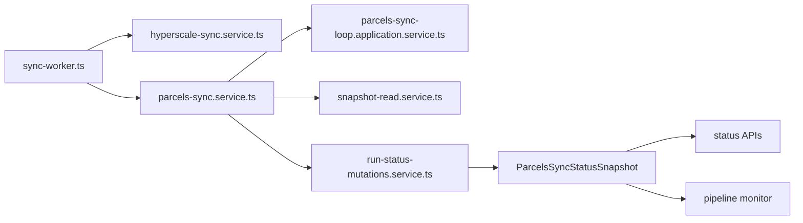

The API runtime splits into two processes on purpose:

- the HTTP server for request and response work
- the sync worker for long-running operational loops

This page is about the second process only.

## Worker entrypoint

`apps/api/src/sync-worker.ts` is the composition root for background sync behavior. Its job is not to parse HTTP requests. Its job is to start the long-lived controllers, keep them running, and stop them cleanly on shutdown.

The worker currently starts:

- the hyperscale sync loop
- the parcels sync loop

Both are treated as runtime services with explicit lifecycle control.

## Hyperscale sync boundary

`apps/api/src/sync/hyperscale-sync.service.ts` owns the hyperscale side of the worker. It is the separate operational path that keeps mirrored hyperscale data fresh before that data is served back through geo routes.

The important boundary is that hyperscale sync is a worker concern, not an HTTP concern:

- route handlers can read served data
- the worker keeps the underlying mirrored data current

## Parcels sync boundary

`apps/api/src/sync/parcels-sync.service.ts` is the app-facing shell for parcel sync, but the real orchestration lives deeper:

- `application/parcels-sync-loop.application.service.ts` owns recurring execution and loop timing
- `application/parcels-sync-status-query.service.ts` reads the live status snapshot exposed to UI consumers
- `run-status-mutations.service.ts` reconciles filesystem markers, progress hints, and inferred state into the current `ParcelsSyncRunStatus`

This split matters because the worker does not treat the filesystem markers as raw log noise. It normalizes them into a stable status model.

## Status model

The authoritative transport-side shape lives in `apps/api/src/sync/parcels-sync.types.ts`.

Key pieces:

- `ParcelsSyncPhase`: `idle`, `extracting`, `loading`, `building`, `publishing`, `completed`, `failed`
- `ParcelsSyncRunStatus`: the live run envelope
- `ParcelsSyncRunProgress`: phase-specific nested progress
- `ParcelsSyncStatusSnapshot`: the UI-facing top-level snapshot

That status model is what the pipeline monitor and API status surfaces consume.

## Filesystem-backed truth

The worker runtime treats on-disk files as first-class state:

- active run markers
- latest completed run pointers
- per-state checkpoints
- build-progress snapshots
- completed run summaries

`snapshot-read.service.ts` and `run-status-mutations.service.ts` are the key files to read when you need to understand how those files become a coherent status object.

## Why the worker is separate from HTTP

The separation prevents a common failure mode: tying request-serving reliability to long-running extraction or tile-build lifecycle.

The current architecture keeps these concerns apart:

| Concern | Owning runtime |
| --- | --- |
| request parsing, envelopes, route registration | HTTP server |
| recurring sync schedule | worker |
| filesystem marker reconciliation | worker |
| status snapshot reads for UI consumers | worker-produced state, HTTP-exposed transport |

## Cross-surface consumers

The worker does not exist in isolation. Its state is consumed by:

- the parcel sync status APIs exposed from `apps/api`
- the pipeline monitor in `apps/pipeline-monitor`
- the operational recovery guides and parcel workflow docs

Use this page together with:

- [API Runtime Foundations](/docs/applications/api-runtime)
- [Parcels Sync Status And Files](/docs/data-and-sync/parcels-sync-status-and-files)
- [Pipeline Monitor](/docs/applications/pipeline-monitor)
- [Troubleshooting And Recovery](/docs/operations/troubleshooting-and-recovery)
