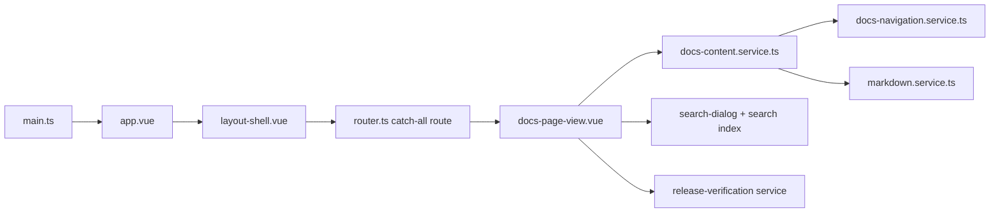

`apps/docs` is a standalone Vue 3 + Vite application. It is intentionally isolated from product runtime code. The docs app can inspect repo files as source material, but it should not import `apps/web`, `apps/api`, or `apps/pipeline-monitor` runtime modules into the docs bundle.

## Runtime entrypoints

### Boot

- `apps/docs/src/main.ts` creates the Vue app, installs the docs router, and loads the global Tailwind and Prism styles.
- `apps/docs/src/app.vue` keeps the root surface thin by delegating shell ownership to `layout-shell.vue`.
- `apps/docs/src/router.ts` uses a catch-all route so every docs page resolves through the same page view and content registry.

That means route rendering is content-driven rather than file-route-driven.

## Shell ownership

### Layout shell

`apps/docs/src/features/docs/components/layout-shell.vue` owns:

- the sticky header
- the left navigation rail
- the mobile navigation drawer
- the search dialog trigger
- the theme toggle
- the home hero

The shell is persistent. Individual content pages render inside it.

### Route page view

`apps/docs/src/features/docs/pages/docs-page-view.vue` is the route-level composition surface. It decides:

- whether the current route exists
- whether the page should render the home body or prose body
- when to show release verification data
- which previous and next links to expose

That keeps page rendering thin while content lookup and navigation ordering stay outside the SFC.

## Content pipeline

### Content sources

The docs app reads authored pages under `apps/docs/src/content`.

The content registry lives in `apps/docs/src/features/docs/docs-content.service.ts`.

### Navigation and ordering

`apps/docs/src/features/docs/docs-navigation.service.ts` is the information-architecture registry. It decides:

- which top-level section a page belongs to
- route slugs
- prev/next ordering
- navigation group ordering

When the docs app feels coherent, it is largely because the information architecture is encoded explicitly there instead of being inferred from filesystem order.

### Markdown rendering

`apps/docs/src/features/docs/markdown.service.ts` owns:

- Markdown to HTML rendering
- heading extraction for the table of contents
- search-section extraction
- syntax highlighting with Prism
- callout container handling for `:::note` and `:::warning`
- Mermaid block parsing for fenced `mermaid` diagrams

This is the main transformation boundary in the docs app.

## Search and verification

### Search

- `apps/docs/src/features/docs/composables/use-search-dialog.ts` manages search-dialog state.
- `apps/docs/src/features/docs/components/search-dialog.vue` renders the UI.
- `docs-content.service.ts` builds the search index from page headings, prose, search terms, and source paths.

### Release verification

The release-checklist route is not only prose. It renders live coverage checks from:

- `release-verification.service.ts`
- `release-verification-panel.vue`

That panel checks whether representative routes are both present in navigation and discoverable through the current search index.

## Design reference boundary

The docs app intentionally ports the Tailwind Plus Syntax structure rather than inventing a new shell. The authoritative style and shell reference remains the in-repo template under `docs/tailwind-plus-syntax/syntax-ts`.

## Related reading

- [Docs Authoring](/docs/contributing/docs-authoring) for the conventions used when adding more pages to this runtime.
