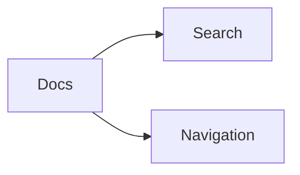

Use this page when you add or update docs content in the Vue docs app. The goal is not just to write a Markdown file. The goal is to keep navigation, search, table of contents behavior, and Tailwind Plus Syntax parity aligned with the rest of the docs surface.

## Where docs content lives

There is one content source in this app:

| Content type | Where to edit it | Why it exists |
| --- | --- | --- |
| Authored docs pages | `apps/docs/src/content/**/*.md` | Current explanatory docs maintained inside the Vue docs app. |

For new contributor-facing or runtime-facing pages, add authored Markdown under `apps/docs/src/content`.

## The authoritative wiring

The docs app uses a small set of files as source of truth:

- `apps/docs/src/features/docs/docs-navigation.service.ts` controls section order, page order, derived slugs, nav grouping, and prev/next links.
- `apps/docs/src/features/docs/docs-content.service.ts` parses frontmatter and loads authored pages.
- `apps/docs/src/features/docs/markdown.service.ts` defines the supported Markdown behavior, heading extraction, syntax highlighting, callouts, and search sections.

If you add a page but do not update the right wiring file, the route tree will drift even if the Markdown itself looks correct.

## Add or update a page

1. Put the page in the nearest meaningful content folder under `apps/docs/src/content`.
2. Use a kebab-case filename such as `parcel-and-tile-workflows.md` or `docs-authoring.md`.
3. Add the required frontmatter fields.
4. Register the page order in `docs-navigation.service.ts`.
5. Add internal docs links and frontmatter `sources` together.
6. Run the docs checks and browser verification before finishing.

## Frontmatter contract

Every authored docs page should start with frontmatter like this:

```md
---
title: Page Title
description: One sentence summary of the page.
searchTerms:
  - alternate phrase
  - repo keyword
sources:
  - apps/api/src/app.ts
  - packages/contracts/src/index.ts
---
```

### Required fields

| Field | Purpose |
| --- | --- |
| `title` | The page title shown in the docs header, navigation, and search. |
| `description` | The summary used in the page header and search results. |

### Recommended fields

| Field | Purpose |
| --- | --- |
| `searchTerms` | Extra phrases that users are likely to search for. |
| `sources` | Authoritative runtime files, scripts, packages, or repo docs that this page explains. |

### Supported but discouraged overrides

`slug`, `order`, `sectionTitle`, and `sectionOrder` are supported by the content pipeline, but authored pages should usually not set them. The normal rule is to let `docs-navigation.service.ts` stay authoritative for route structure and page ordering.

## Navigation and route rules

The navigation tree is curated, not inferred from filenames alone.

- Add new authored pages to the nearest existing top-level section before you consider creating a new section.
- Update `docsNavigationDefinitions` in `apps/docs/src/features/docs/docs-navigation.service.ts` for every new page.
- Keep section and page order stable once routes are published, because search grouping and prev/next links depend on that order.
- If a new page materially changes repo information architecture, update [Information Architecture](/docs/repository/information-architecture) in the same change.

## Heading and table-of-contents rules

The page title comes from frontmatter and the shared docs header. Inside the Markdown body:

- start at `##`, not `#`
- use `###` only under a preceding `##`
- keep headings descriptive enough to produce clean anchor slugs

The renderer fails fast if an `h3` appears before any `h2`. That is intentional because the table of contents and section-level search entries depend on a clean heading hierarchy.

## Code fences, tables, and callouts

Use standard fenced code blocks:

````md
```bash
bun --cwd apps/docs build
```
````

Current syntax highlighting is configured for:

- `bash` plus `shell`, `sh`, and `zsh`
- `json`
- `yaml` and `yml`
- `markdown`
- `sql`
- `typescript`
- `tsx`
- `jsx`

Mermaid diagrams are supported through fenced `mermaid` blocks:

````md

````

Use Mermaid for architecture, runtime, and workflow diagrams where the flow is easier to understand visually than through a table alone.

Unknown languages fall back to plain text, so prefer one of the supported labels.

Use standard Markdown tables for command inventories, package matrices, and workflow comparisons.

Use these callout forms when you need emphasis without breaking the prose flow:

````md
:::note Runtime Split
Explain a helpful but non-blocking detail here.
:::

:::warning Authoritative Sources
Explain a rule that contributors should not violate.
:::
````

Callouts are intentionally limited to `note` and `warning` so the presentation stays consistent with the rest of the docs app.

## Cross-links and source paths

When you explain a runtime, package, workflow, or repo rule:

- link to related docs pages with root-relative docs routes such as `/docs/applications/api-runtime`
- add the real file paths to frontmatter `sources`
- keep the prose explanatory instead of copying large source excerpts into the page

Frontmatter `sources` should still point to the real runtime files or repo docs the page explains, even though the docs app no longer renders a dedicated companion panel for them.

## Preserve Tailwind Plus Syntax parity

This docs app is a Vue port of the in-repo Tailwind Plus Syntax reference. Treat that reference as the design system.

- Reuse the existing fonts, spacing, gradients, prose treatment, and shell patterns.
- Do not invent one-off docs layouts, new accent systems, or alternate typography stacks.
- Make shared style changes in the docs app's common surfaces such as `tailwind.css`, shared components, or the Markdown renderer instead of per-page hacks.
- Compare any UI change against `docs/tailwind-plus-syntax/syntax-ts`, especially the shared shell components and `src/styles/{tailwind,prism}.css`.

If the Vue implementation needs to differ for framework reasons, keep the rendered result equivalent and document the reason inside the affected page or shared implementation.

## Browser verification workflow

Every docs story is expected to include a browser pass with `agent-browser`.

### Required breakpoints

- desktop: `1440x900`
- mobile: `390x844`

### Minimum verification flow

1. Start the docs app locally with `bun --cwd apps/docs dev` or preview the production build.
2. Open the touched route with `agent-browser`.
3. Confirm the shell, typography, spacing, and page structure still match the Tailwind Plus Syntax reference closely.
4. Verify search, navigation, TOC behavior, and diagram rendering when the change affects them.
5. Capture at least one screenshot for the touched surface.

### Typical browser commands

```bash
agent-browser open http://127.0.0.1:5173
agent-browser set viewport 1440 900
agent-browser screenshot docs-desktop.png
agent-browser set viewport 390 844
agent-browser screenshot docs-mobile.png
```

When a change introduces or updates a Mermaid chart, verify that the route renders an SVG diagram instead of a raw fenced code block at both breakpoints.

Use [Release Checklist](/docs/contributing/release-checklist) for the final route set, search checks, and screenshot expectations before treating a docs change as releasable.

## Review checklist for contributors

Before finishing a docs change, confirm all of the following:

- the page lives in the correct section and is registered in `docs-navigation.service.ts`
- frontmatter `title` and `description` are present
- `sources` point to real files or repo docs
- internal docs links use the real route structure
- heading order produces a valid TOC
- code fences use supported language labels
- any UI or style change preserves Tailwind Plus Syntax parity
- browser verification was attempted at desktop and mobile breakpoints

## Required commands

```bash
bun --cwd apps/docs lint
bun --cwd apps/docs typecheck
bun --cwd apps/docs build
bun x ultracite fix apps/docs docs
bun x ultracite check apps/docs docs
```
