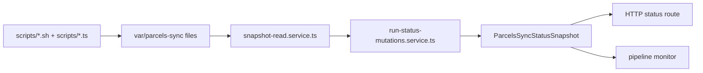

Parcel sync state is distributed across scripts, worker code, and UI consumers. The repo keeps that understandable by converging on one shared phase model and one shared snapshot shape.

## The shared phase model

`apps/api/src/sync/parcels-sync.types.ts` defines the canonical phase sequence:

1. `idle`
2. `extracting`
3. `loading`
4. `building`
5. `publishing`
6. `completed`
7. `failed`

Everything else in the stack should be read as a projection of that phase model.

## Filesystem state

The worker and scripts read and write a common state set under `var/parcels-sync`.

The most important files are:

| File | Meaning |
| --- | --- |
| `active-run.json` | The current heartbeat and current phase hint for the active run. |
| `latest.json` | Pointer to the newest completed run. |
| `run-summary.json` | Completed extraction summary for a specific run. |
| `state-*.checkpoint.json` | Resume-safe extraction checkpoints per state. |
| tile-build progress snapshots | Build-phase detail used to derive tile conversion progress. |

The scripts write those files. The worker turns them into a coherent status snapshot.

## Worker-side reconciliation

`run-status-mutations.service.ts` is the most important status-normalization file in the repo for parcel operations.

It is responsible for:

- deciding which run ID is currently authoritative
- deciding whether an active heartbeat is stale
- converting raw checkpoint files into state progress lists
- merging build-progress snapshots into the run status
- deriving terminal states such as `completed` or `failed`

This is the layer that prevents UIs from having to interpret raw filesystem markers themselves.

## API-facing snapshot

`application/parcels-sync-status-query.service.ts` exposes the worker’s normalized view as a `ParcelsSyncStatusSnapshot`.

That snapshot carries:

- whether sync is enabled
- the current mode and interval
- the latest completed run metadata
- the full live `run` object with phase, summary, log tail, progress, and per-state status

This is what UI consumers should treat as the transport boundary.

## Pipeline monitor boundary

The pipeline monitor reads the API-facing snapshot, not the filesystem directly.

The main read path is:

- `apps/pipeline-monitor/src/features/pipeline/pipeline.service.ts`
- `apps/pipeline-monitor/src/features/pipeline/pipeline.view.ts`

That keeps the monitor as an operator-facing visualization layer instead of a second operational source of truth.

## What each surface is for

| Surface | Use it for |
| --- | --- |
| shell and TypeScript scripts | executing the parcel flow |
| worker snapshot services | normalizing operational state |
| HTTP status endpoints | transporting the normalized state |
| pipeline monitor | visualizing the normalized state |
| troubleshooting guides | telling operators what to do next |

## When to inspect which file

- If a run looks stuck in extraction, inspect `active-run.json`, `latest.json`, and the per-state checkpoints.
- If the UI says the run is building, inspect the build-progress snapshot and `postextract-<RUN_ID>.log`.
- If publish state looks inconsistent, inspect the PMTiles manifest and publish markers alongside the worker snapshot.

## Related reading

- [API Sync Runtime](/docs/applications/api-sync-runtime)
- [Sync Architecture](/docs/data-and-sync/sync-architecture)
- [Pipeline Monitor](/docs/applications/pipeline-monitor)
- [Monitoring And Rollback](/docs/operations/monitoring-and-rollback)
