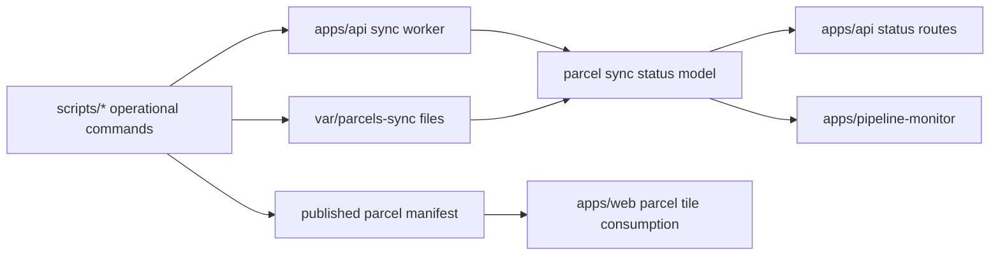

The repo has a distinct cross-cutting surface that does not fit cleanly inside a single app or a single troubleshooting page. This section documents that surface directly.

## Core sync path

The parcel production flow spans four layers:

1. Operational scripts in `scripts/*` start and advance the run.
2. The background worker in `apps/api/src/sync-worker.ts` manages long-running sync loops.
3. Geo-serving routes in `apps/api/src/geo/parcels` expose sync status and parcel-serving metadata.
4. `apps/pipeline-monitor` visualizes the run state for operators.

## Concrete source areas

| Source area | Why it belongs in this section |
| --- | --- |
| `apps/api/src/sync-worker.ts` | Starts the long-running hyperscale and parcel sync loops. |
| `apps/api/src/geo/parcels/**` | Exposes parcel sync status, detail, enrich, and coherency-sensitive serving behavior. |
| `apps/pipeline-monitor/src/features/pipeline/**` | Visualizes ingestion progress, publish state, and stalled phases. |
| `scripts/refresh-parcels.sh` | Entry point for the parcel refresh lifecycle. |
| `scripts/load-parcels-canonical.sh` | Moves extracted data into the canonical serving path. |
| `scripts/publish-parcels-manifest.ts` | Advances the published tile manifest. |
| `scripts/rollback-parcels-manifest.ts` | Reverts the published tile manifest when the latest publish is not safe. |

## Route responsibilities

- Use the application pages when you need app-local runtime detail.
- Use this page when the concern crosses script execution, sync workers, API status, and monitoring views.
- Use [Parcel And Tile Workflows](/docs/operations/parcel-and-tile-workflows) for command-level execution detail.
- Use [Troubleshooting And Recovery](/docs/operations/troubleshooting-and-recovery) for incident response and recovery steps.

## Why this route is part of the IA

The PRD requires a stable home for data and sync flows because those concerns otherwise get split between app docs, package docs, and troubleshooting guidance. This route makes that shared seam first-class.
