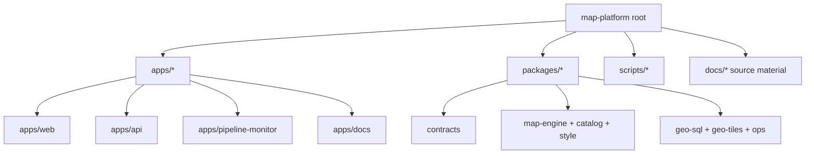

The root workspace uses Bun workspaces plus Turbo orchestration. The root `package.json` is the authoritative inventory for workspace-level commands, while `README.md` and `AGENTS.md` explain how contributors are expected to move through the repo.



## Workspace layout

| Path | Role |
| --- | --- |
| `apps/web` | Vue 3 + Vite map application built on MapLibre and shared map packages. |
| `apps/api` | Hono API for boundaries, facilities, parcels, providers, markets, and sync status. |
| `apps/pipeline-monitor` | Vue dashboard for parcel pipeline progress and publish state. |
| `apps/docs` | Vue docs app that documents the repo without changing product behavior. |
| `packages/contracts` | Shared Zod schemas, route builders, and transport contracts. |
| `packages/map-engine` | MapLibre adapter and engine-facing interfaces. |
| `packages/map-layer-catalog` | Layer IDs, defaults, visibility budgets, and catalog validation. |
| `packages/map-style` | Base style helpers and layer ordering constraints. |
| `packages/geo-sql` | SQL query specs for geospatial reads. |
| `packages/geo-tiles` | Tile manifest parsing, versioning, and publish helpers. |
| `packages/ops` | Shared operational helpers like request IDs and diagnostics. |
| `packages/bench` | Endpoint budget definitions. |
| `packages/fixtures` | Dataset tier definitions for benchmark and scale framing. |
| `scripts` | Operational shell and TypeScript entrypoints for sync, load, tile publish, and rollback. |

## Shared root commands

```bash
bun install
bun run dev
bun run dev:all
bun run dev:web
bun run dev:api
bun run dev:api:sync-worker
bun run dev:pipeline-monitor
bun run dev:docs
bun run build
bun run build:docs
bun run test
bun run lint
bun run typecheck
bun x ultracite fix
bun x ultracite check
```

### What those commands mean

| Command | Use |
| --- | --- |
| `bun install` | Install all workspace dependencies. |
| `bun run dev` | Start the default product surfaces (`apps/web` and `apps/api`). |
| `bun run dev:all` | Start every workspace that exposes a `dev` script. |
| `bun run dev:web` | Run only the web application. |
| `bun run dev:api` | Run only the API. |
| `bun run dev:api:sync-worker` | Run the API sync worker loop without the HTTP runtime. |
| `bun run dev:pipeline-monitor` | Run the pipeline monitor UI. |
| `bun run dev:docs` | Run the isolated Vue docs app. |
| `bun run build` | Build the whole workspace through Turbo. |
| `bun run build:docs` | Build only the docs app. |
| `bun run test` | Run package and app tests through Turbo. |
| `bun run lint` | Run workspace lint tasks through Turbo. |
| `bun run typecheck` | Run workspace typechecking through Turbo. |
| `bun x ultracite fix` | Apply the repo formatting and lint fixes expected before review. |
| `bun x ultracite check` | Verify the repo still matches the Ultracite/Biome ruleset. |

### Docs-only checks

Use these when the task is intentionally limited to docs surfaces and minimal workspace wiring:

```bash
bun --cwd apps/docs lint
bun --cwd apps/docs typecheck
bun --cwd apps/docs build
bun x ultracite fix apps/docs docs
bun x ultracite check apps/docs docs
```

### Additional targeted scripts

| Command | Use |
| --- | --- |
| `bun run typecheck:docs` | Typecheck only the docs app through Turbo filtering. |
| `bun run build:pipeline-monitor` | Build only the pipeline monitor. |
| `bun run typecheck:pipeline-monitor` | Typecheck only the pipeline monitor. |
| `bun run sync:hyperscale` | Refresh the hyperscale dataset inputs used by the parcel workflow. |
| `bun run init:parcels-schema` | Create or repair the parcel schema before canonical loads. |
| `bun run load:parcels-canonical` | Load canonical parcel data into the serving schema. |
| `bun run tiles:build:parcels` | Build the parcels PMTiles file set. |
| `bun run sync:parcels` | Run the full parcel refresh and publish preparation workflow. |
| `bun run tiles:publish:parcels` | Publish the current parcel manifest. |
| `bun run tiles:rollback:parcels` | Roll back the parcel manifest pointer. |

Operational scripts are documented in [Parcel And Tile Workflows](/docs/operations/parcel-and-tile-workflows). Use that page for phase order, generated files, and rollback expectations rather than treating the command list above as sufficient operational guidance.

## Repository conventions from `AGENTS.md`

### Tooling and review baseline

- Keep Biome aligned with the Ultracite presets and run `bun x ultracite fix` before final review.
- Prefer docs and code changes that stay inside the requested surface area instead of drifting into unrelated cleanup.

### Vue and feature-structure rules

- Vue work uses Composition API with `<script setup lang="ts">`.
- Route views should stay thin and delegate stateful behavior to focused composables and services.
- Feature-specific contracts belong in `*.types.ts`.
- Reusable pure helpers belong in `*.service.ts`.

### Naming, exports, and type safety

- File and directory names are kebab-case, including Vue component file paths.
- Do not add one-line export-wrapper files when a local barrel or direct import already exists.
- Avoid type assertions when a runtime guard, explicit annotation, or discriminated union can express the same intent.
- Prefer `const` and `readonly` defaults, with mutations kept inside explicit state holders.

### Production-path rules

- The repo defaults to one real implementation path.
- Runtime fallbacks, legacy branches, and source-mode toggles are not added unless there is an explicit migration request.
- Required infrastructure should fail fast with clear errors instead of silently degrading behavior.

## Where contributors usually start

1. Read `README.md` for the workspace inventory and the root command set.
2. Read `AGENTS.md` for repo constraints before editing anything.
3. Read [Repository Architecture](/docs/repository/architecture) for the current runtime and package boundaries.
4. Read the app or package page that matches the surface you are changing.
5. Read the relevant operations or repository page when the task references prior design work, review notes, or operator guidance already present in the repo.
