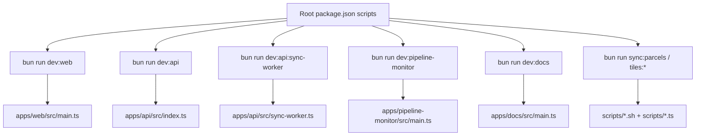

This page exists to answer a simple question fast: "which file or command actually starts this thing?" The repo has several useful commands, but they do not all point at the same class of runtime. Some start watched UIs, some run the API, some launch the sync worker, and some execute one-shot operational scripts.

## Runtime entrypoint map

| Surface | Default command | Real entrypoint |
| --- | --- | --- |
| Web app | `bun run dev:web` | `apps/web/src/main.ts` via the Vite dev server in `apps/web` |
| API HTTP runtime | `bun run dev:api` | `apps/api/src/index.ts` |
| API sync worker | `bun run dev:api:sync-worker` | `apps/api/src/sync-worker.ts` |
| Pipeline monitor | `bun run dev:pipeline-monitor` | `apps/pipeline-monitor/src/main.ts` |
| Docs app | `bun run dev:docs` | `apps/docs/src/main.ts` |

The key distinction is the API split. `apps/api/src/index.ts` owns the HTTP runtime, while `apps/api/src/sync-worker.ts` owns the background parcel-sync loop. They are related, but they are not the same runtime.

## Root command families

### Product development commands

These are the commands contributors use when working on application surfaces:

- `bun run dev`
- `bun run dev:web`
- `bun run dev:api`
- `bun run dev:api:sync-worker`
- `bun run dev:pipeline-monitor`
- `bun run dev:docs`

These commands are orchestration-level convenience wrappers. They are the stable human interface, but not the authoritative source for runtime behavior.

### Workspace quality gates

These commands verify or build code instead of serving an app:

- `bun run build`
- `bun run build:docs`
- `bun run typecheck`
- `bun run typecheck:docs`
- `bun run lint`
- `bun x ultracite fix`
- `bun x ultracite check`

### Operational parcel commands

These commands move data, build artifacts, or change the published tile state:

- `bun run init:parcels-schema`
- `bun run sync:hyperscale`
- `bun run sync:parcels`
- `bun run load:parcels-canonical`
- `bun run tiles:build:parcels`
- `bun run tiles:publish:parcels`
- `bun run tiles:rollback:parcels`

Read [Parcel And Tile Workflows](/docs/operations/parcel-and-tile-workflows) for phase order and artifacts. The list above is just the command map.

## Script inventory by file type

### Shell wrappers

| File | Purpose |
| --- | --- |
| `scripts/init-parcels-schema.sh` | Applies the parcel schema and base SQL before loads. |
| `scripts/refresh-hyperscale.sh` | Refreshes mirrored hyperscale inputs and derived serving tables. |
| `scripts/refresh-parcels.sh` | Top-level parcel workflow wrapper for extract, load, build, and publish. |
| `scripts/load-parcels-canonical.sh` | Canonical parcel load and table-swap entrypoint. |
| `scripts/build-parcels-draw-pmtiles.sh` | PMTiles build step for the parcel draw dataset. |
| `scripts/run-parcels-sync-launchd.sh` | Scheduler-oriented wrapper that prevents duplicate sync starts. |

### TypeScript operational entrypoints

| File | Purpose |
| --- | --- |
| `scripts/refresh-parcels.ts` | The real parcel extraction runtime that writes checkpoints and summaries. |
| `scripts/publish-parcels-manifest.ts` | Advances the live parcel manifest pointer after a successful build. |
| `scripts/rollback-parcels-manifest.ts` | Repoints the live manifest to the previous parcel artifact. |

### SQL artifacts

| File | Purpose |
| --- | --- |
| `scripts/sql/parcels-canonical-schema.sql` | Base schema and object creation for the canonical parcel path. |
| `scripts/sql/spatial-analysis-overhaul.ddl.sql` | Supporting SQL artifact for the spatial-analysis overhaul work. |

## How to decide which source is authoritative

- For human-invoked command names, use root `package.json`.
- For actual operational behavior, read the underlying script or TypeScript entrypoint.
- For background parcel state, read the sync worker and the status artifacts under `var/parcels-sync`.
- For application behavior, use the app `src/main.ts` entrypoint and then move into the feature/runtime docs for that surface.

## Common mistakes this page prevents

### Treating dev wrappers as production behavior

`bun run dev:api:sync-worker` is useful for development, but it is not the same thing as the repo's scheduled production parcel workflow.

### Confusing the API server with the sync worker

The HTTP runtime serves requests. The sync worker advances long-running parcel operations and status updates. Changes in one do not automatically imply changes in the other.

### Reading only the shell wrapper

Several shell scripts delegate the real work into TypeScript entrypoints or downstream commands. When you need phase behavior, resume logic, or artifact semantics, follow the chain into the TypeScript runtime or SQL artifact.
