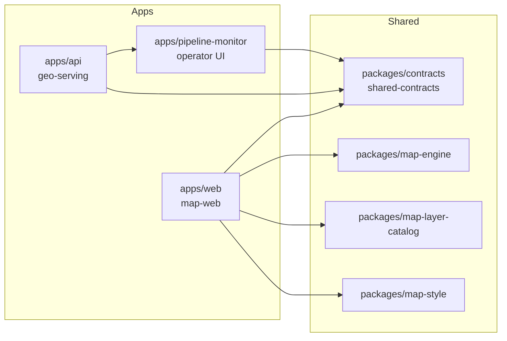

This repository currently enforces a small set of explicit boundaries instead of a deep layer stack. The clearest statement of that direction lives in `docs/architecture/ddd.qmd`, and the implementation matches it closely.

Read [Design Principles](/docs/repository/design-principles) when you want the rationale behind those boundaries rather than only the boundary map itself.

## Current bounded contexts

- `geo-serving`: API endpoints and supporting services that return map-facing geospatial data.
- `map-web`: viewport-driven rendering, layer policy, and interaction behavior in `apps/web`.
- `shared-contracts`: transport schemas, headers, route helpers, and shared response conventions in `packages/contracts`.

## Application boundaries

### `apps/web`

The web app is the interactive map runtime. It owns map composition, layer policy, facility and parcel interactions, page routing, and UI overlays.

### `apps/api`

The API owns transport parsing, response envelopes, request policy, route registration, SQL-backed reads, and long-running sync loops.

### `apps/pipeline-monitor`

The pipeline monitor is a separate operational surface for parcel pipeline status. It should be understood as an operator-facing companion, not as part of the map UI runtime.

## Shared package boundaries

### Contracts first

`packages/contracts` is the shared transport boundary reused by API and web. When a response shape or request parser is shared, it belongs here before it belongs in an app-local helper.

### Map runtime isolation

`packages/map-engine` is the engine seam. It wraps MapLibre operations behind `IMap` and related types so the rest of the web app does not directly own raw engine wiring everywhere.

### Catalog and style governance

`packages/map-layer-catalog` holds runtime-governed layer IDs, visibility defaults, and dependency rules. `packages/map-style` holds style-layer mapping and ordering invariants.

## Operational architecture

The parcel production path is explicit:

1. Extract and refresh with `scripts/refresh-parcels.sh`.
2. Load canonical data with `scripts/load-parcels-canonical.sh`.
3. Build PMTiles with `scripts/build-parcels-draw-pmtiles.sh`.
4. Publish or rollback manifests with `scripts/publish-parcels-manifest.ts` and `scripts/rollback-parcels-manifest.ts`.

The operations guidance in this docs app documents the operational failure modes that hang off that path.

## Design context

The authored docs in this app explain the current repo shape directly. When you need the reasoning behind those boundaries, use [Design Principles](/docs/repository/design-principles) and the package or application pages that own the current runtime surface.

## Docs information architecture

The docs route structure mirrors those boundaries:

- Getting started
- Repository architecture
- Applications
- Packages
- Data and sync
- Operations
- References
- Contribution guidance

Read [Information Architecture](/docs/repository/information-architecture) for the concrete route prefixes, section ownership, and the source-area mapping that keeps the docs tree stable enough for prev/next navigation, search indexing, and direct linking.

:::warning Authoritative Sources
When a docs page and a runtime file disagree, the runtime file wins. Docs are explanatory. Source files and operational files remain authoritative.
:::
