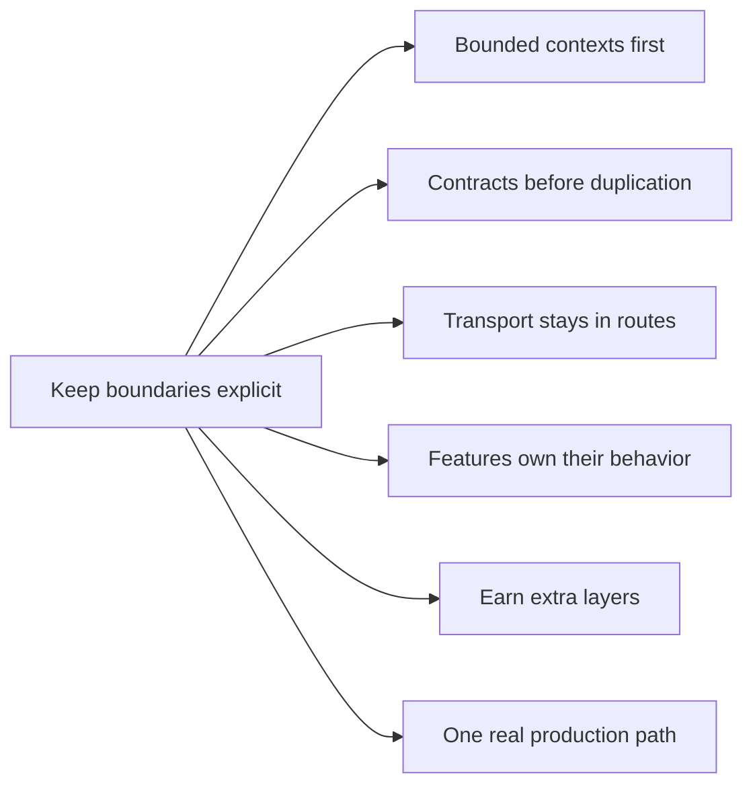

This page explains why the repo is structured the way it is. It is not a generic DDD explainer. It is the set of principles that best explains the concrete boundaries you see in this workspace today.

## The main idea

The codebase prefers explicit boundaries and small modules over deep architecture templates.

That leads to a few visible choices:

- apps are split by runtime responsibility instead of by technology label alone
- shared contracts are extracted before app-local duplication spreads
- route handlers stay transport-focused
- feature code stays owned by the feature instead of disappearing into generic utility buckets
- extra layers are added only when they remove real coupling

## Bounded contexts first

The repo is easier to reason about when each major runtime has a clear job:

- `geo-serving` owns API-facing geospatial reads and sync-adjacent transport surfaces
- `map-web` owns map rendering, viewport-driven behavior, and frontend interaction policy
- `shared-contracts` owns request and response shapes that must stay consistent across apps

This is why `apps/api`, `apps/web`, and `packages/contracts` feel central to the architecture. They are not arbitrary folders. They reflect the main seams the codebase actually depends on.

## Contracts before duplication

Shared transport rules are centralized early on purpose.

In this repo that means:

- schemas live in `packages/contracts`
- route builders live in `packages/contracts`
- headers such as request correlation stay consistent across app boundaries
- operational request metadata comes from shared helpers such as `packages/ops`

The reason is simple: once API and frontend code invent their own request or response shape independently, drift becomes normal. Centralizing contracts is cheaper than cleaning that up later.

## Transport stays in routes

The API shape is intentionally direct.

Routes own:

- parsing
- status codes
- headers
- response envelopes
- transport-level error policy

Repositories own read access. Mappers own row-to-contract shaping. Services are added when orchestration or domain policy becomes real enough to deserve them.

That is why many API slices follow a pattern like:

- `*.route.ts`
- `*.repo.ts`
- `*.mapper.ts`

and only grow into route-service-repo-mapper when the slice complexity actually earns it.

## Extra layers must earn their keep

This repo does not add abstraction because a template says it should.

Promote a slice into more layers when one of these becomes true:

- query or upstream logic stops being trivial
- the same business rule is reused across endpoints
- mapping grows beyond a simple projection
- a route starts mixing transport decisions with domain decisions

Avoid the opposite failure too:

- generic repository abstractions that hide SQL intent
- base services that exist only because inheritance feels architectural
- one-file-per-concept ceremony before the complexity exists

The principle is not "stay simple forever." The principle is "pay for structure when the code actually needs it."

## Features own their behavior

Frontend code follows the same rule.

Feature behavior belongs with the feature:

- `apps/web/src/features/<feature>` keeps domain behavior localized
- orchestration entry files stay thin
- `*.types.ts` and `*.service.ts` absorb contracts and pure helpers when a feature grows
- the map engine stays behind `packages/map-engine` instead of leaking raw engine concerns everywhere

This is why the frontend is organized around feature domains rather than one large global hooks or utils layer. Ownership stays visible.

## One real production path

The repo strongly prefers one supported runtime path over hidden fallback behavior.

That principle shows up in several places:

- Postgres-backed serving paths are treated as the real path
- sync and tile workflows are documented as the actual operational sequence
- required infrastructure should fail fast instead of silently degrading
- temporary compatibility branches are treated as migration work, not normal architecture

This keeps the docs, runtime behavior, and operational expectations aligned. People should not have to guess which code path is actually real.

## Shared operational consistency matters

Some concerns are cross-cutting enough that they should stay consistent across contexts.

Request correlation is a good example:

- request IDs should be preserved across the web and API boundary
- generation should come from one shared helper
- transport metadata should not fork by app unless there is a deliberate reason

This kind of shared operational behavior is small, but it removes a surprising amount of debugging friction later.

## What this means when adding new code

When you add or change a slice, ask these questions first:

1. Which bounded context actually owns this behavior?
2. Is this a transport concern, a query concern, a mapping concern, or a reusable orchestration concern?
3. Does this need a new shared contract, or should it stay local?
4. Am I adding structure because the code needs it, or because I expect architecture to look a certain way?
5. Am I documenting and implementing one real production path, or accidentally creating fallback ambiguity?

Those questions are a better fit for this repo than blindly applying a framework of layers.

## Reading path

- Read [Repository Architecture](/docs/repository/architecture) for the current runtime boundaries.
- Read [Information Architecture](/docs/repository/information-architecture) for how those boundaries map into the docs tree.
- Read the app and package pages next when you need to see how these principles show up in concrete code.
